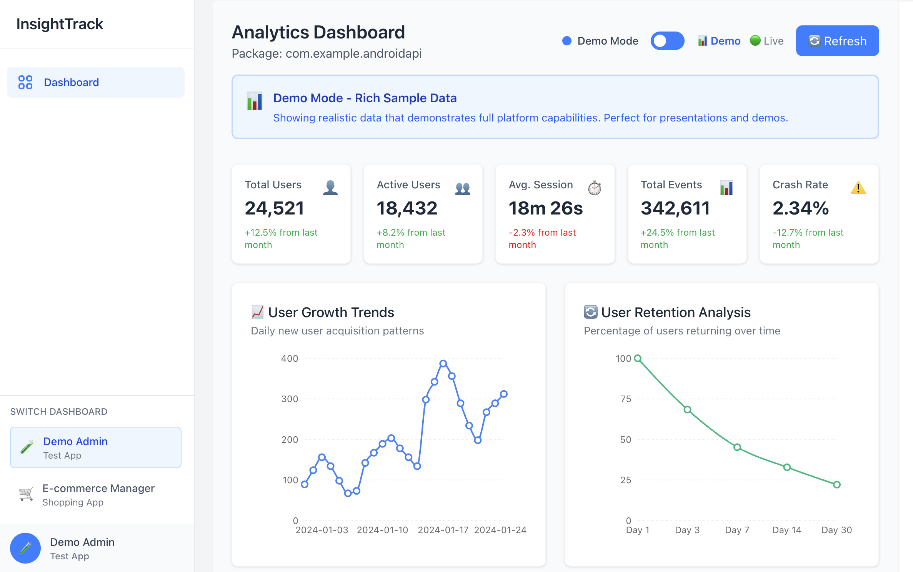
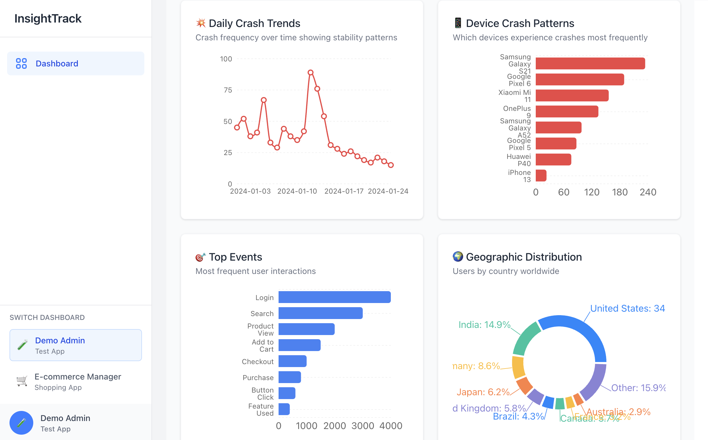
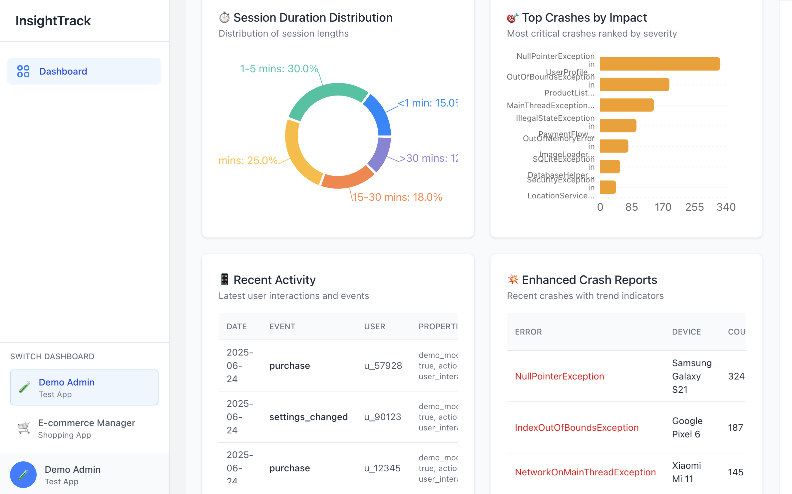
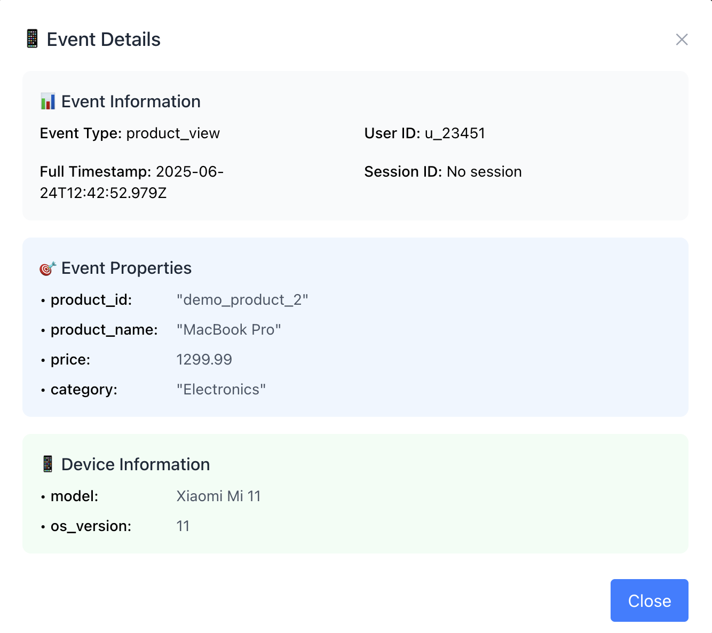
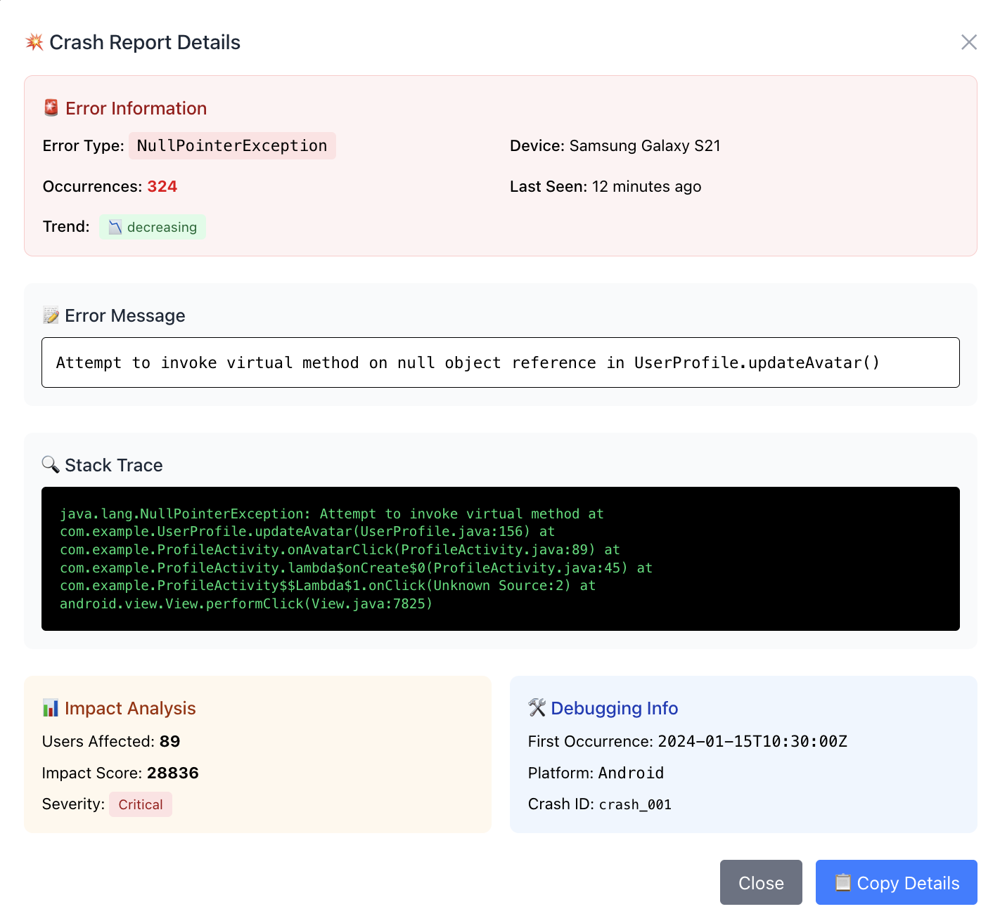

# InsightTrack Analytics SDK

[](https://jitpack.io/#michaelarie96/InsightTrack)
[](https://opensource.org/licenses/MIT)

> **Complete Analytics SDK Ecosystem** - Track user behavior, sessions, events, and crashes with enterprise-grade analytics infrastructure

InsightTrack is a comprehensive analytics solution that provides developers with a powerful Android SDK, robust backend API, and intuitive admin dashboard to track and analyze user behavior in mobile applications.

## 🎯 What You Get

- **📊 Real-time Analytics Dashboard** - See user behavior instantly
- **📱 Screen Tracking** - Know which screens users visit most
- **💰 E-commerce Insights** - Track purchases and conversions
- **💥 Crash Reporting** - Automatically detect and report crashes
- **🌐 Offline Support** - Events saved when offline, sent when online
- **🔒 Privacy Focused** - GDPR compliant, no personal data required

---

## 🚀 Quick Start (5 Minutes)

### 1. Add to Your App

**In your app's `build.gradle`:**
```kotlin
dependencies {
    implementation 'com.github.michaelarie96:InsightTrack:v1.0.7'
}
```

### 2. Initialize (One Time Setup)

**Create or edit your Application class:**
```kotlin
class MyApplication : Application() {
    override fun onCreate() {
        super.onCreate()
        
        InsightTrackSDK.Builder.with(this)
            .setApiKey("your-api-key")  // Get this from the InsightTrack team
            .useProduction("insighttrack-dashboard.app")  // Demo server (not deployed)
            .build()
    }
}
```


### 3. Track Events (Anywhere in Your App)

```kotlin
// ✨ Super simple - just describe what happened
InsightTrackSDK.getInstance().trackEvent("User shared a photo")

// 📝 Simple with category
InsightTrackSDK.getInstance().trackEvent("button_click", "User tapped the like button")

// 🏢 Advanced (for complex apps)
InsightTrackSDK.getInstance().trackPurchase("order_123", 29.99)
```

**That's it!** Your app is now tracking user behavior. 

---

## 📊 Complete Analytics Tracking

### 🎯 Custom Event Tracking
```kotlin
// ✨ Simple - describe anything that happens
InsightTrackSDK.getInstance().trackEvent("User completed tutorial")
InsightTrackSDK.getInstance().trackEvent("User subscribed to premium")

// 📝 Organized - categorize your events
InsightTrackSDK.getInstance().trackEvent("video_action", "User played intro video")
InsightTrackSDK.getInstance().trackEvent("social_share", "User shared on Instagram")

// 🔧 Advanced - custom properties for detailed analysis
InsightTrackSDK.getInstance().trackEvent("level_completed", mapOf(
    "level" to 5,
    "score" to 1250,
    "time_spent" to 120,
    "difficulty" to "hard"
))
```

### 🛍️ E-commerce Analytics
```kotlin
// Complete purchase funnel tracking
InsightTrackSDK.getInstance().trackProductView("iphone15", "iPhone 15", 999.0, "Electronics")
InsightTrackSDK.getInstance().trackAddToCart("iphone15", "iPhone 15", 999.0, 1)
InsightTrackSDK.getInstance().trackCheckout()
InsightTrackSDK.getInstance().trackPurchase("order_456", 999.0)
```

### 👤 User Journey Tracking
```kotlin
// User identification and authentication
InsightTrackSDK.getInstance().setUserId("user_12345")
InsightTrackSDK.getInstance().trackLogin("email")
InsightTrackSDK.getInstance().trackLogout()

// Screen and navigation tracking
InsightTrackSDK.getInstance().trackScreenView("MainActivity")
InsightTrackSDK.getInstance().trackButtonClick("share_button")
InsightTrackSDK.getInstance().trackFeatureUsed("premium_feature")
```

### 🔍 Search & Discovery
```kotlin
// Track user search behavior
InsightTrackSDK.getInstance().trackSearch("laptop", 25) // query and results count
InsightTrackSDK.getInstance().trackSettingsChanged("notifications", true)
InsightTrackSDK.getInstance().trackProfileUpdated()
```

### 💥 Automatic Crash & Error Tracking
```kotlin
// Automatic crash reporting (set up in Application class)
try {
    riskyOperation()
} catch (exception: Exception) {
    InsightTrackSDK.getInstance().logCrash(exception)
}

// Manual error logging
InsightTrackSDK.getInstance().logError("API_ERROR", "Failed to load user data")
```

---

## 📸 Analytics Dashboard Preview

<div align="center">

### 📊 Complete Analytics Overview


*Real-time analytics with user growth, retention analysis, and comprehensive metrics*

<br><br>

### 💥 Crash And Event Analytics  


*Device crash patterns, daily trends, and geographic event distribution*

<br><br>

### 📱 Interactive Data Tables


*Session duration analysis, crash impact ranking, and clickable activity tables*

<br><br>

### 🔍 Detailed Event Inspection


*Click any event to see complete details including user info, properties, and device data*

<br><br>

### 🛠️ Developer-Friendly Crash Reports


*Full stack traces, impact analysis, and debugging information for quick issue resolution*

<br>

</div>

**Features Shown:**
- 📈 Real-time user growth and retention analytics
- 🌍 Geographic user distribution worldwide  
- 💥 Comprehensive crash reporting with trends
- 📱 Device-specific crash patterns
- 🎯 Top events and user interaction tracking
- 🔍 Clickable tables with detailed modals
- 📊 Session duration and engagement analysis

---

## 🔧 Configuration Options

### Development vs Production

#### 🏠 Development Setup
```kotlin
// For local testing with your Flask server
InsightTrackSDK.Builder.with(this)
    .setApiKey("test-key")
    .useLocalDevelopment(5001)  // Your Flask server port
    .build()
```

**Requirements:**
1. Run Flask server locally: `python app.py`
2. Allow HTTP traffic for Android (create `network_security_config.xml`):
```xml
<?xml version="1.0" encoding="utf-8"?>
<network-security-config>
    <domain-config cleartextTrafficPermitted="true">
        <domain includeSubdomains="false">10.0.2.2</domain>
        <domain includeSubdomains="false">localhost</domain>
    </domain-config>
</network-security-config>
```
3. Add to `AndroidManifest.xml`:
```xml
<application
    android:networkSecurityConfig="@xml/network_security_config"
    ...>
```

#### 🌐 Production Setup
```kotlin
// For live apps with your deployed backend
InsightTrackSDK.Builder.with(this)
    .setApiKey("your-api-key")
    .useProduction("your-analytics-api.vercel.app")  // YOUR deployed Flask server
    .build()
```

**Requirements:**
1. Deploy your Flask backend to Vercel/Heroku/AWS/etc.
2. Set up MongoDB Atlas database
3. Use your deployed server URL

---

## 📋 Requirements

- **Minimum Android**: API 26 (Android 8.0)
- **Permissions**: Internet access (automatically added)
- **Size**: < 500KB added to your app

---

## 📄 License

MIT License - use in any project, commercial or personal.

---

**📌 Maintained by:** Michael Arie
